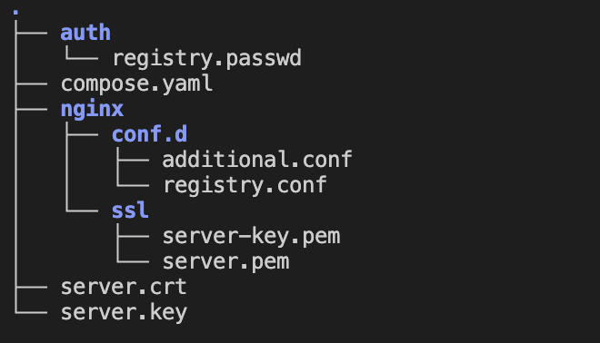

# Private Docker Registry setup and nginx configuration
---

> This repository follows this [medium.](https://medium.com/@shubnimkar/how-to-set-up-and-use-private-docker-registry-with-authentication-web-ui-361ee39b2079)

So This is file structure when completely setup.


when you clone this repo please follow this step.

## 1. Generate the necessary keys
Generate the key using the command below, then move the files to .nginx/ssl/.

```bash
openssl req -x509 -nodes -days 365 -newkey rsa:2048 \
  -keyout server-key.pem \
  -out server.pem
```

## 2. Add Root CA
Add the Root CA certificate to Docker and the host system by following the commands below.

<br>
Run this command inside .nginx/ssl/:

```bash
openssl x509 -in server.pem -inform PEM -out server.crt
```

Create a directory for Docker certificates (replace domain like. 10.1.1.88 or registry.code4.dad)

```bash
mkdir -p /etc/docker/certs.d/registry.[domain]/
```

```bash
cp server.crt /etc/docker/certs.d/registry.[domain]/
```

Create a directory for the host system CA:

```bash
mkdir -p /usr/share/ca-certificates/extra/
```

```bash
cp server.crt /usr/share/ca-certificates/extra/
```

Reload CA certificates and restart Docker:

```bash
dpkg-reconfigure ca-certificates
```

```bash
systemctl restart docker
```

## 3. Add USER

Run the following command inside .auth/:

```bash
htpasswd -Bc registry.passwd [username]
```

## 4. Edit configuration 

`registry.conf`

- Update server_name

- Recheck exposed ports

`docker-compose.yml`

Services included:

- Registry (public port 5555 → container port 5000)

- Nginx

- Portainer (port 9000)

## 5. Add Insecure Registry

You have to add insecure registry to docker.

Edit `daemon.json`
> Window and MAC: use Docker Desktop > Setting > Docker Engine

> Docker Linux Daemon: /etc/docekr/daemon.json

```bash
{
  "builder": {
    "gc": {
      "defaultKeepStorage": "20GB",
      "enabled": true
    }
  },
  "experimental": false,
  "insecure-registries": [
    "161.246.6.23"
  ]
}
```

## 6. RUN

After completing the setup, start the project:

```bash
docker compose up -d
```

Login to your private registry
(for example: `docker login 10.1.1.88`)

```bash
docker login [domain]
```

Try to push/pull image to private registry (authentication required)

```bash
docker push [domain]/alpine:latest
```

```bash
docker pull [domain]/alpine:latest
```